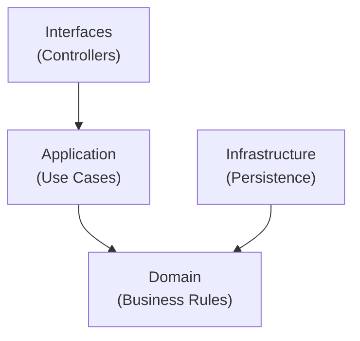
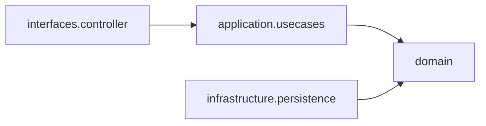

# 📘 Coupon API — DDD + Clean Architecture

## 📌 Visão Geral

API REST para gerenciamento de cupons construída com **Java 17 + Spring Boot**, aplicando princípios de **DDD (Domain-Driven Design)** e **Clean Architecture**, priorizando:

- separação de responsabilidades
- regras de negócio isoladas
- testabilidade
- manutenibilidade
- baixo acoplamento

O sistema permite criação e exclusão lógica de cupons garantindo consistência das regras de domínio.

---

## 🏗 Arquitetura — DDD + Clean Architecture

O projeto segue os princípios de Clean Architecture, mantendo o domínio isolado de frameworks e infraestrutura.

### Fluxo de dependência

### Organização baseada em pacotes

---

### Benefícios dessa arquitetura

✅ Separação clara de responsabilidades  
✅ Domínio independente de framework  
✅ Alta testabilidade  
✅ Baixo acoplamento  
✅ Fácil evolução  

---

## 📋 Regras de Negócio

### ✅ Criação de cupom

Campos obrigatórios:

- `code`
- `description`
- `discountValue`
- `expirationDate`

Regras:

- Código alfanumérico com **6 caracteres**
- Caracteres especiais são removidos automaticamente
- Valor mínimo de desconto: **0.5**
- Sem limite máximo de desconto
- Data de expiração não pode estar no passado
- Cupom pode ser criado como publicado

---

### ❌ Exclusão de cupom

- Exclusão é **soft delete**
- Dados históricos são preservados
- Não é permitido deletar cupom já deletado

---

## 🧪 Testes Automatizados

O projeto utiliza:

- **JUnit 5**
- **Mockito**

Cobertura focada em:

- use cases
- validações de domínio
- comportamento de serviços

Executar testes:
mvn test
Relatório Jacoco:
target/site/jacoco/index.html

---

## 📚 Swagger / OpenAPI

Documentação interativa disponível em:
http://localhost:8080/swagger-ui.html

Permite:

- explorar endpoints
- testar requisições
- visualizar contratos

---

## 💾 Banco de Dados — H2

Banco em memória para desenvolvimento e testes.

Console:

http://localhost:8080/h2-console

---

## 🐳 Docker

A aplicação pode ser executada em container.

### Subir aplicação

API disponível em:

http://localhost:8080

---

## ⚙ Tecnologias

- Java 17
- Spring Boot 3
- Spring Data JPA
- H2 Database
- JUnit 5
- Mockito
- Swagger / OpenAPI
- Docker + Docker Compose
- Maven

---

## 🚀 Fluxo da aplicação

Controller - Use Case - Domain - Repository (interface) - Infrastructure (JPA)

---

## ▶ Executando localmente

### Maven

mvn clean package
java -jar target/*.jar

### Docker

docker-compose up --build

---

## 🎯 Objetivo do Projeto

Demonstrar:

- aplicação prática de DDD
- Clean Architecture
- boas práticas REST
- testes automatizados
- organização escalável
- containerização

---

